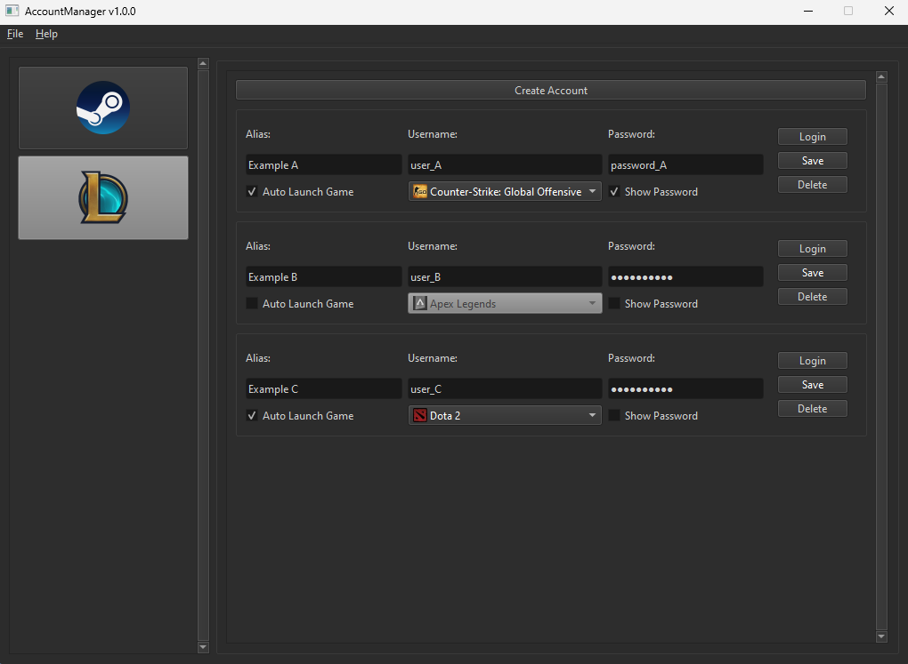

# Acc Man
*Josh Bailey* 

## Contents
- [Acc Man](#acc-man)
	- [Contents](#contents)
	- [Overview](#overview)
	- [Features](#features)
	- [Platforms](#platforms)
	- [How to Use](#how-to-use)

## Overview
AccountManager (Acc Man) was designed with the intention of speeding up the process of switching between accounts, across a variety of platforms.

## Features
- Create multiple accounts
- Local account saving/loading
- Local account encryption/decryption
- Auto launch game on login
  - Apex Legends
  - Counter-Strike: Global Offensive
  - Dota 2
  - Grand Theft Auto V
  - PUBG: Battlegrounds
  - Rust
  - Team Fortress 2

## Platforms
- Steam
- League of Legends (WIP)

## How to Use
1) Select a platform (Steam).
2) Select "Create Account".
3) Enter your Steam login credentials.
4) Select "Save" to locally store your details. You will find them encrypted inside of the "accounts" directory within your installation path.
5) Configure "Auto Launch Game" (by default this is turned off).
6) Select "Login" to launch Steam and automatically log you in. If an existing Steam session is already open, this process will be terminated. If you have configured "Auto Launch Game", the selected game will automatically launch after login.
7) If you wish to update your account details, simply edit them in the application and click "Save".
8) If you wish to delete your account details, select "Delete" on the associated account. This will also delete the encrypted account details stored locally under the "accounts" directory within your installation path.

